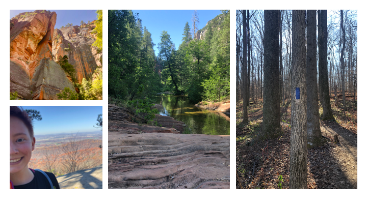
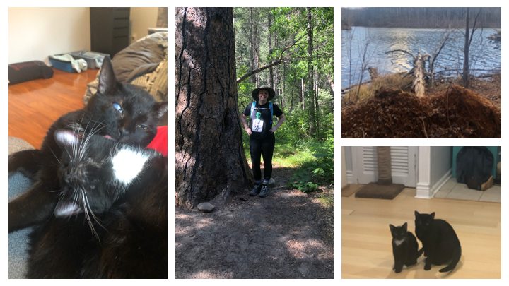

# About

## Beginnings with the Arizona Twin PRoject

100 home visits, 30,000 miles, 6 terabytes of video data, and hours in the lab helping manage and enter data from the 600+ families participating in the project, the Arizona Twin Project at Arizona State University was my launching pad into a career in genetic research. The opportunities I had to learn from every pair of twins I met has inspired me to pursue a career that could positively impact child health and development.

## Research Interests and Contributions

My broad research interests are the genetic and environmental variables that are related to the development of psychopathologies in children and adolescents. So far, I've contributed data analysis, figure/table creation, and assistance with manuscript writing on three publications related to this interest. The references for these publications and  details about my other projects can be found on my CV.

## Independent Projects

I've also completed several independent projects relating to factors that influence child health and development. I completed a senior thesis under the direction of Arizona Twin Project Primary Investigators, Drs. Mary Davis and Kathryn Lemery-Chalfant. We used computer-coded emotion data during a dyadic parent-child interaction to look at how much emotion expression related with child chronic pain measures, and whether parent measures of pain catastrophizing mediated this relationship. 

In 2018, I became a Translational Genomics Research Institute (TGen) Helios Scholar, and went on to be one of seven speakers selected from the 45 interns to give a talk. I presented my work, which looked at early life measures of harsh punishment their relationship with measures of DNA methylation of stress genes. 

## Outside of the Lab

I spend my days outside of the lab taking care of my two rescue cats, my hedgehog, and my plants. I enjoy getting outside and hiking the Maryland trails year round, and to unwind I make huge batches of soup with whatever is left in my kitchen, practice yoga, and play minecraft with friends. (pictured: Guy, Rock Lee, and Me!)

