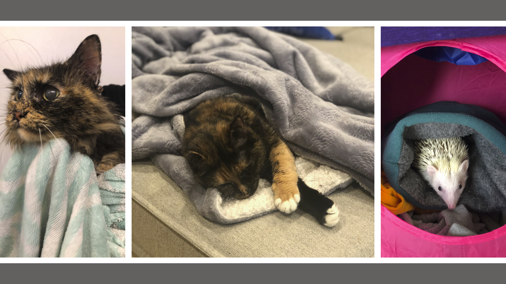
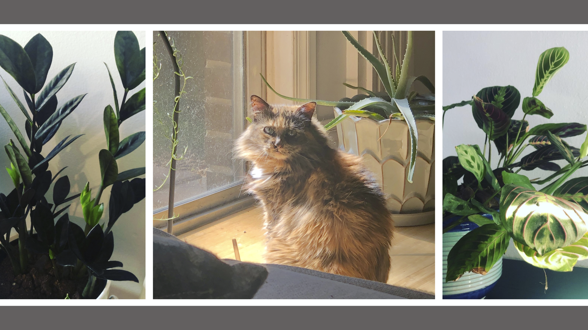

---
categories:
- about
draft: false
showpagemeta: false
tags:
- about
title: About
---

Hayley Sowards is currently a postbaccalaureate fellow doing post-GWAS functional analysis of melanoma risk variants. While she is currently working on cancer genomics, her broad research interests are the genetic and environmental variables that are related to the development of psychopathologies in children and adolescents. 

Outside of her scientific endeavors, Hayley spends her days taking care of her various living things (pictured: Mom, Khaleesi, and Chihiro)

